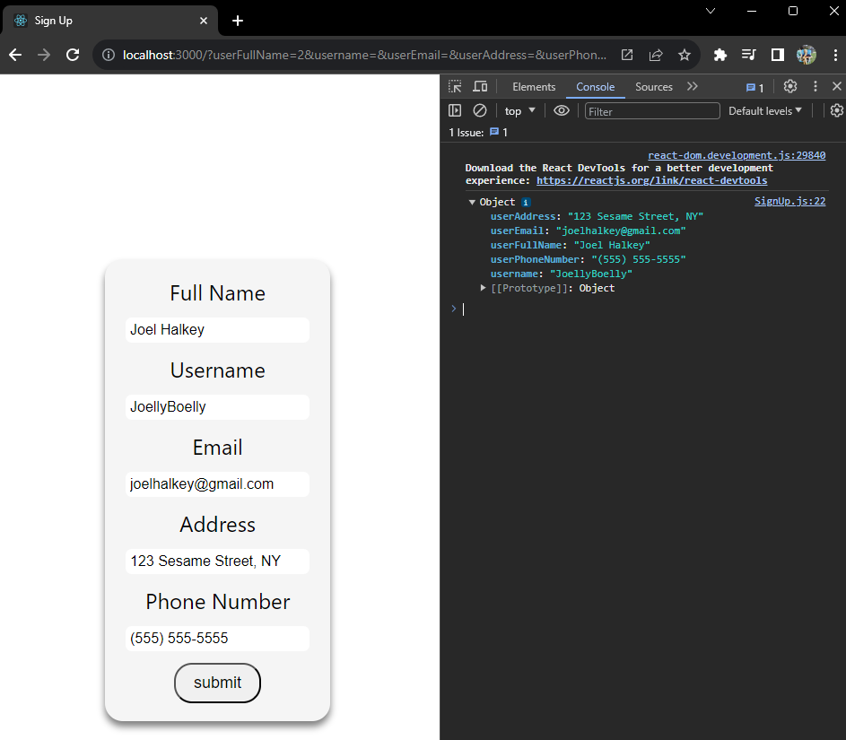

# React Component Code Explanation

The image below demonstrates the output that's being taken from the current state, which is from the form that's currently filled out.



## React State Management

### useState()

Project code usage example:
```javascript 
const [formData, setFormData] = React.useState({
    userFullName: "",
    username: "",
    userEmail: "",
    userAddress: "",
    userPhoneNumber: ""
});
```
Essentially, the use of `useState()` is to be able to initialize a set of variables that are to be used as state variables. This means that, in practice, they have the most updated data that can be set and retrieved using `setFormData` and `formData` respectively (shown below).

**Setter:** `setFormData()`

```javascript
// Changes the current state every time the user changes the value of the inputs in the form.
function handleChange(e){                               
        const { name, value } = e.target;    
        // setFormData allows you to take the previous data from the state
        // and change it depending on what value was changed.   
        setFormData((prevFormData) => {     
            return{              
                // The spread operator allows you to retrieve the previous data and add-to/change it.    
                ...prevFormData,                
                [name]: value,              
            };                                  
        });                                         
    }    
```  


**Getter:** `formData`

```html
<!-- HTML for Signing Up -->
<div className='sign-up-container'>
    <form onSubmit={submitForm} className='sign-up-form'>
    <!-- {/* Full Name */} -->
    <label htmlFor='user-full-name'>Full Name</label>
    <!-- userFullName is accessed from the state through the getter -->
    <input
        type='text'
        className='user-full-name'
        id='user-full-name'
        name='userFullName'
        placeholder='e.g. Jane Doe'
        value={formData.userFullName}   
        onChange={handleChange}
    />    
    ...
```

<hr>

### useEffect()

Using `useEffect()` for this project was unnecessary so there aren't any in-project usage examples; however, `useEffect()` allows for events to take place when dependencies of the program change. Shown below is a skeleton of code and possible usages of `useEffect()`.

```javascript
useEffect(() => {
    // Data fetching side effect using an API call
    fetch('https://api.example.com/data')
      .then(response => response.json())
      .then(data => setData(data));


    return () => {
      // Used to return HTML with the data gathered from the API/Function call.
    };
  }, []);  
  // This list is used for dependencies, which means if a variable or 
  // dependency you put inside of the list changes at any point, the actions 
  // above the return statement with be triggered again. 
```

